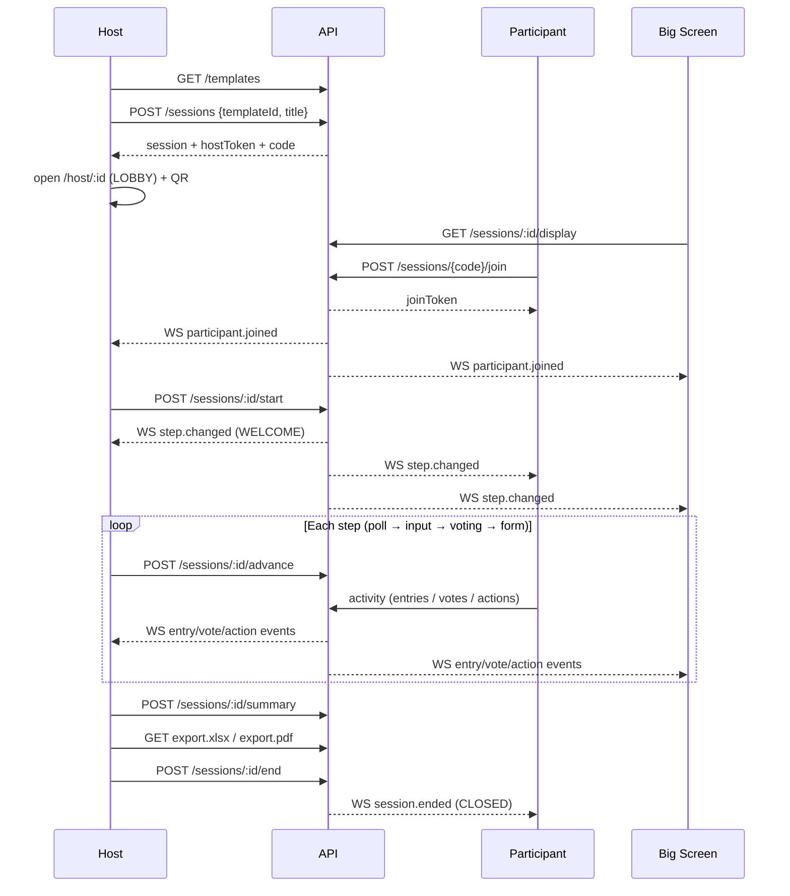

# Workshop OS — All Flows

> **Production note:** Live deploy on Render uses **Firebase Firestore** (see `main`), not Spring Boot/Postgres. The host / participant / big-screen flows below still describe the product. Persistence and realtime are Firestore `onSnapshot` instead of REST + STOMP.


Hybrid workshop facilitation: **Host laptop** · **Participant mobile web** · **Big Screen**.

Stack: Angular 18 (`web/`) + Spring Boot REST / STOMP (`api/`) + Postgres.

---

## 1. Actors & surfaces

| Actor | URL | Device | Auth |
|---|---|---|---|
| Host | `/` or `/host` → `/host/:sessionId` | Laptop | `X-Host-Token` (issued once on create) |
| Participant | `/j` → `/p/:sessionId` | Phone | `X-Join-Token` (issued once on join) |
| Big Screen | `/display/:sessionId` | Projector / TV | None (public) |

There is **no traditional login** (no users / passwords / OAuth / JWT). Access is token-based:

| Token | Issued when | Stored | Sent as | Verified against |
|---|---|---|---|---|
| `hostToken` | `POST /api/sessions` | `localStorage` → `wos_host_token` | `X-Host-Token` | SHA-256 of `sessions.host_token_hash` |
| `joinToken` | `POST /api/sessions/{code}/join` | `localStorage` → `wos_join_token` | `X-Join-Token` | SHA-256 of `participants.join_token_hash` |

Join codes are 6 characters from `ABCDEFGHJKLMNPQRSTUVWXYZ23456789` (no I/O/0/1).

---

## 2. Happy path (end-to-end)



1. Host opens `/`, picks a template + title → **Create session**.
2. Host lands on `/host/:id` in **LOBBY** with join code + QR (`{origin}/j?code={CODE}`).
3. Big screen opens `/display/:sessionId` (tokenless).
4. Participants open `/j`, enter code + name → join → `/p/:id`.
5. Host clicks **Start session** → first step activates.
6. Host advances through **welcome → poll → input → voting → form**.
7. Participants interact per step type; host + display update live over STOMP.
8. Host generates **AI summary**, downloads **Excel/PDF**, then **Ends** the session (`CLOSED`).

---

## 3. Session lifecycle

### Status enum

`DRAFT` · `LOBBY` · `WELCOME` · `RUNNING` · `SUMMARIZING` · `ACTIONS` · `EXPORTING` · `CLOSED`

### Transitions actually used

```
create ──────────────────────────────► LOBBY
start ───────────────────────────────► WELCOME  (first step type = welcome)
                                    or RUNNING
advance / back ──────────────────────► WELCOME | RUNNING | ACTIONS
                                       (welcome→WELCOME, form→ACTIONS, else RUNNING)
POST /summary ───────────────────────► SUMMARIZING
end ─────────────────────────────────► CLOSED
```

**Unused today:** `DRAFT`, `EXPORTING` (export does not change status).

### Per-step status

On the cloned `session_steps`: `PENDING` → `ACTIVE` → `DONE`.

- On create: all steps `PENDING`; `currentStepId` points at the first step (not yet `ACTIVE`).
- On start / advance / back: current → `DONE` (when leaving), target → `ACTIVE`.

### Join rules

Participants may join any time **except** when status is `CLOSED`. Mid-session joins are allowed.

---

## 4. UI routes

| Path | Component | Purpose |
|---|---|---|
| `''` / `host` | `HostSetupComponent` | Create workshop (title + template) |
| `host/:id` | `HostLiveComponent` | Live control: QR, Start/Back/Next/End, AI summary, Excel/PDF, open big screen, live results |
| `j` | `JoinComponent` | Participant join (code + display name; supports `?code=`) |
| `p/:id` | `ParticipantLiveComponent` | Mobile activity UI driven by `currentStep.type` |
| `display/:sessionId` | `DisplayComponent` | Projector view: lobby code, poll bars, sticky columns, vote board, actions + AI insights |
| `**` | redirect → `''` | Fallback |

---

## 5. Host flows

### 5.1 Create session

1. `GET /api/templates` → list templates.
2. Host picks template + optional title.
3. `POST /api/sessions` `{ templateId, title? }`.
4. API clones template steps/groups into a new session (`LOBBY`), returns session view + **one-time** `hostToken`.
5. Frontend stores token and navigates to `/host/:id`.

### 5.2 Lobby / QR

- Shows join code, QR (`/j?code={CODE}`), participant count, **Open big screen** link.
- Live updates via STOMP `participant.joined`.

### 5.3 Step control

| Action | Endpoint | Effect |
|---|---|---|
| Start session | `POST /api/sessions/{id}/start` + `X-Host-Token` | Activate first step |
| Next step | `POST /api/sessions/{id}/advance` | Current → DONE, next → ACTIVE |
| Back | `POST /api/sessions/{id}/back` | Previous step |
| End | `POST /api/sessions/{id}/end` | Status → `CLOSED` |

All of these publish `step.changed` or `session.ended` on `/topic/session/{id}`.

### 5.4 Live results (host panel)

`ActivityHostPanelComponent` renders based on current step type:

- **poll** — bar chart from `GET …/poll/tally`
- **input** — sticky wall + **Hide** (`DELETE …/entries/{id}`)
- **voting** — sticky wall + Hide + vote leaderboard
- **form** — actions table

### 5.5 AI summary

1. Host clicks **AI summary** → `POST /api/sessions/{id}/summary` + `X-Host-Token`.
2. Status → `SUMMARIZING`.
3. Aggregates non-hidden entries, top vote tallies, actions.
4. Provider (`AI_PROVIDER`, default `groq`; or `ollama`). Empty `GROQ_API_KEY` → **heuristic fallback**.
5. Persists to `ai_summaries`; publishes `summary.ready`.

### 5.6 Export

| Button | Endpoint | Output |
|---|---|---|
| Excel | `GET /api/sessions/{id}/export.xlsx` + `X-Host-Token` | Sheets: Entries, Actions, Summary |
| PDF | `GET /api/sessions/{id}/export.pdf` + `X-Host-Token` | Report: entries, actions, AI insights |

Status is **not** changed to `EXPORTING`.

---

## 6. Participant flows

### 6.1 Join

1. Open `/j` (or QR `/j?code=XXXXXX`).
2. Enter display name (+ code if not prefilled).
3. `POST /api/sessions/{code}/join` `{ displayName }`.
4. Receive `sessionId`, `participantId`, `joinToken`.
5. Navigate to `/p/:sessionId`; connect STOMP.

Fails if session is `CLOSED`.

### 6.2 Per-step activity

| Step type | Participant UI | API call |
|---|---|---|
| **welcome** | Read instructions | — |
| **poll** | Tap one option | `POST …/entries` `{ content: optionId }` + `X-Join-Token` (replaces prior answer) |
| **input** | Pick group + sticky text | `POST …/entries` `{ content, groupId? }` (+ anonymous if config says so) |
| **voting** | Vote on prior input stickies | `POST …/votes` `{ entryId }` (budget from `votesPerParticipant`, default 3) |
| **form** | Action / owner / due date | `POST …/actions` `{ action, owner?, dueDate? }` |

Lobby / closed states show wait / ended messages.

---

## 7. Big Screen (display) flows

- Tokenless: `GET /api/sessions/{id}/display` + STOMP subscribe.
- **LOBBY** — large join code + participant count.
- **welcome** — title + instructions.
- **poll** — live bars from `poll/tally`.
- **input** — sticky columns by group.
- **voting** — vote leaderboard.
- **form** — actions table (+ AI insights when present).
- Updates on every WS event (`step.changed`, `entry.*`, `vote.updated`, `action.created`, `summary.ready`, `session.ended`).

---

## 8. Step types (activity model)

Enum: `welcome` | `poll` | `input` | `voting` | `form`

| Type | Config | Host | Participant | Display |
|---|---|---|---|---|
| welcome | `{}` | Instructions | Read-only | Large title/instructions |
| poll | `options: [{id,label}]` | Bar chart | Tap option | Live bars |
| input | `anonymous: bool` | Sticky wall + Hide | Group + text | Columns by group |
| voting | `votesPerParticipant: int` | Wall + Hide + leaderboard | Cast votes (budget) | Ranked leaderboard |
| form | `{}` | Actions table | Submit action | Actions (+ AI) |

**Voting data source:** all non-hidden session entries whose step type is `input` (not limited to the immediately previous step). For OKR boards (`boardMode: 'okr'`), voting lists **Key Results only** (`kind: 'kr'` / `parentId` set).

**Anonymous input:** when `anonymous:true`, `authorId` is stored as null. Poll answers always keep the author.

---

## 9. Templates (seeded)

Default workspace `11111111-1111-1111-1111-111111111111`.

All three templates share the sequence: **welcome → poll → input → voting → form**.

### Sprint Retrospective (`retro`)

| # | Type | Title | Config / groups |
|---|---|---|---|
| 1 | welcome | Welcome | |
| 2 | poll | Check-in | great / ok / rough |
| 3 | input | Sprint Reflection | anonymous; What went well? · What to improve? · Action ideas |
| 4 | voting | Prioritize | 3 votes |
| 5 | form | Action Plan | |

### Strategy Workshop (`strategy`)

| # | Type | Title | Config / groups |
|---|---|---|---|
| 1 | welcome | Welcome | |
| 2 | poll | Alignment check | clear / partial / unclear |
| 3 | input | Opportunities & Risks | named; Opportunities · Risks · Bets |
| 4 | voting | Prioritize themes | 5 votes |
| 5 | form | Commitments | |

### OKRs (`okrs`)

Linked Objective → Key Result → Action workflow:

| # | Type | Title | Config / groups |
|---|---|---|---|
| 1 | welcome | Welcome | Host seeds Objectives later |
| 2 | poll | Confidence | high / med / low |
| 3 | input | OKR board | `boardMode: 'okr'`; host adds Objectives; participants attach KRs (`parentId`) |
| 4 | voting | Prioritize KRs | 3 votes; **KRs only** |
| 5 | form | Commitments | `linkTo: 'kr'`; action stores `sourceEntryId` + `sourceLabel` |

**Big screen:** Top-down collapsible tree (session → Objectives → Key Results) with `+`/`−` toggles; node colors by type — primary (root), purple (Objectives), green (Key Results). KR branches start collapsed when ≥ 4 KRs. Action plan shows each action tagged with its KR.

**Format builder:** Purpose field + “Linked board (Objective → KR)” on input steps + “Link action to Key Result” on form steps.

---

## 10. REST API reference

Base: `/api`. Health: `GET /actuator/health`.

### Templates — `/api/templates`

| Method | Path | Auth | Notes |
|---|---|---|---|
| GET | `/templates` | none | List for default workspace |
| GET | `/templates/{id}` | none | Single template + steps |

### Sessions — `/api/sessions`

| Method | Path | Auth | Body | Notes |
|---|---|---|---|---|
| POST | `/sessions` | none | `{ templateId, title? }` | Create → LOBBY + `hostToken` |
| GET | `/sessions/{id}` | `X-Host-Token` | — | Full host view |
| GET | `/sessions/by-code/{code}` | none | — | Public preview |
| GET | `/sessions/{id}/display` | none | — | Display / participant view |
| POST | `/sessions/{code}/join` | none | `{ displayName }` | Returns `joinToken` |
| POST | `/sessions/{id}/start` | `X-Host-Token` | `{}` | Start |
| POST | `/sessions/{id}/advance` | `X-Host-Token` | `{}` | Next |
| POST | `/sessions/{id}/back` | `X-Host-Token` | `{}` | Previous |
| POST | `/sessions/{id}/end` | `X-Host-Token` | `{}` | Close |

### Activities — `/api/sessions/{sessionId}`

| Method | Path | Auth | Body | Notes |
|---|---|---|---|---|
| POST | `…/entries` | `X-Join-Token` | `{ content, groupId? }` | Sticky or poll answer |
| DELETE | `…/entries/{entryId}` | `X-Host-Token` | — | Soft-hide |
| GET | `…/entries` | none | `?stepId=` | Visible entries (voting → all input stickies) |
| POST | `…/votes` | `X-Join-Token` | `{ entryId }` | Cast vote |
| GET | `…/votes/tally` | none | `?stepId=` | Tallies desc |
| GET | `…/steps/{stepId}/votes/tally` | none | — | Same for step |
| GET | `…/poll/tally` | none | `?stepId=` | Option counts |
| POST | `…/actions` | host **or** join token | `{ action, owner?, dueDate?, sourceEntryId? }` | Create action |
| GET | `…/actions` | none | — | List actions |

### Summary / Export

| Method | Path | Auth | Notes |
|---|---|---|---|
| POST | `/sessions/{id}/summary` | `X-Host-Token` | Generate AI summary |
| GET | `/sessions/{id}/summary` | none | Latest or “No summary yet” |
| GET | `/sessions/{id}/export.xlsx` | `X-Host-Token` | Excel download |
| GET | `/sessions/{id}/export.pdf` | `X-Host-Token` | PDF download |

---

## 11. Realtime (STOMP / SockJS)

- Endpoint: `/ws` (SockJS)
- Subscribe: `/topic/session/{sessionId}`
- Payload: `{ type: string, data: object }`

| Event `type` | When | `data` |
|---|---|---|
| `participant.joined` | join | `participantId`, `displayName`, `participantCount` |
| `step.changed` | start / advance / back | full session view |
| `session.ended` | end | full session view |
| `entry.created` | submit entry/poll | entry view |
| `entry.hidden` | host hide | `{ entryId, hidden: true }` |
| `vote.updated` | cast vote | `{ tally, votesRemaining }` |
| `action.created` | submit action | action view |
| `summary.ready` | AI generate | summary view |

Host, participant, and display clients all subscribe to the same topic and filter by `type`.

---

## 12. Other flows

| Flow | Detail |
|---|---|
| **Load check** | `python3 scripts/load-check.py` — create + start + 50 parallel joins + 50 display GETs; assert `participantCount == 50` |
| **PWA** | `manifest.webmanifest` + `public/sw.js` (caches shell); registered in `main.ts` |
| **CORS** | Default `http://localhost:4200`; set `CORS_ORIGINS` for deploy |
| **AI providers** | `AI_PROVIDER=groq` (default) or `ollama`; empty Groq key → heuristic fallback |
| **Timers** | Template `timer_seconds` seeded; live countdown not wired yet (`timerEndsAt` always null) |

---

## 13. Local run (quick)

```bash
# DB (native Postgres on 5433 — see AGENTS.md / README)
sudo pg_ctlcluster 16 main start   # or: docker compose up -d

# API
cd api && ./mvnw spring-boot:run

# Web
cd web && npm start
```

- Host: http://localhost:4200/
- Join: http://localhost:4200/j
- Big screen: `/display/:sessionId` (link from host control)
