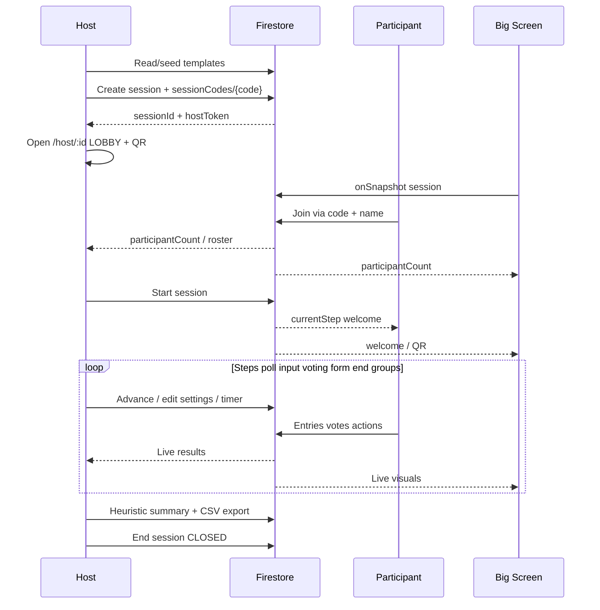

# Workshop OS — Product workflows

Hybrid workshop facilitation: **Host laptop** · **Participant mobile** · **Big Screen**.

**Stack:** Angular 18 (`web/`) + **Firebase Firestore** (Spark, project `workshop-os-bosch`) + Render static hosting.  
**Realtime:** Firestore `onSnapshot` (no REST API / STOMP).  
**Auth:** host/join tokens in `localStorage` (no login).

Live site: https://workshop-os-web.onrender.com/

---

## 1. Actors & surfaces

| Actor | Route (hash) | Device | Auth |
|---|---|---|---|
| Host | `/#/` dashboard, `/#/host` sessions, `/#/host/:id` live | Laptop | `hostToken` |
| Participant | `/#/j` → `/#/p/:sessionId` | Phone | `joinToken` |
| Big Screen | `/#/display/:sessionId` | Projector / TV | None (public read) |

Scan-friendly join QR encodes `/?code=XXXXXX` (loads `index.html`, then routes into `/#/j?code=`).

| Token | Issued when | Stored | Used for |
|---|---|---|---|
| `hostToken` | Session create | `wos_host_token` + `wos_host_sessions[]` | Host writes (start/advance/settings/hide/…) |
| `joinToken` | Join | `wos_join_token` | Participant writes (entries/votes/actions) |

Join codes: 6 chars from `ABCDEFGHJKLMNPQRSTUVWXYZ23456789`.

---

## 2. Happy path (end-to-end)



1. Host opens **Dashboard** (`/#/`), then **Sessions** (`/#/host`).
2. Pick a template (or **Create manual format** / customize) → create or prepare session.
3. Open **big screen**; share QR / code.
4. Participants scan or open join → enter name.
5. Host **Start** → run steps (welcome → poll → input → voting → form → optional groups/end).
6. Host may insert/edit steps, run the timer, hide stickies, generate summary, export CSV.
7. Host **Ends** session (`CLOSED`).

---

## 3. Host navigation

| Route | Component | Purpose |
|---|---|---|
| `/#/` | `HostDashboardComponent` | Live / completed / prepared charts from `wos_host_sessions`, product changelog, **Join as participant** |
| `/#/host` | `HostSetupComponent` | Create / resume workshops, pick templates |
| `/#/host/format` | `FormatBuilderComponent` | Miro-style custom format board |
| `/#/host/:id` | `HostLiveComponent` | Live facilitation console |
| `/#/j` | `JoinComponent` | Participant join |
| `/#/p/:id` | `ParticipantLiveComponent` | Mobile activity UI |
| `/#/display/:sessionId` | `DisplayComponent` | Projector view |

Sidebar brand returns to Dashboard. Join CTA lives on Dashboard only (not Sessions).

### Save for later

Sessions created in this browser are tracked in `localStorage` (`wos_host_sessions`).  
Flow: Create & prepare → title / OKR theme / Objectives in LOBBY → **Save for later** → resume from Sessions. Opening `/host/:id` calls `activateHostSession` so the correct `hostToken` is restored.

---

## 4. Session lifecycle

### Status

`LOBBY` → `WELCOME` | `RUNNING` | `ACTIONS` → `CLOSED`

| Event | Status |
|---|---|
| Create | `LOBBY` |
| Start (first step welcome) | `WELCOME` |
| Start / advance (other) | `RUNNING` |
| On form step | `ACTIONS` |
| End | `CLOSED` |

Per-step flags on embedded `steps[]`: `PENDING` → `ACTIVE` → `DONE`.

Participants may join until the host **locks the room** or ends the session (`CLOSED`).

---

## 5. Host live flows

### Lobby

- Join code, QR (`/?code=`), participant roster/avatars, **Open big screen**.
- **Lock room** / **Unlock room** — blocks or allows new joins (`joinsLocked` on the session).
- Per-participant **Kick** — soft-kick (`kicked` + rotated `joinToken`); the phone is ejected immediately.
- Optional OKR theme / seed Objectives before Start.

### Step control

| Action | Effect |
|---|---|
| Start | Activate first step |
| Next / Back | Move `currentStepId`; update step statuses |
| Add step | `insertStep` — poll / input / voting / form / groups / end after current or at end |
| Step Settings | Edit title, instructions, timer, poll options, columns, votes budget, welcome media, OKR flags (`updateStep`) |
| Timer | Start / pause / resume / reset → `timerEndsAt` + `timerPausedRemaining` on session |
| Hide entry | Soft-hide from participants / display; host can Unhide |
| Delete entry | Permanent delete (host or owner) |
| Lock room | Toggle `joinsLocked` — blocks new participant creates |
| Kick participant | Soft-kick + rotate `joinToken`; decrement `participantCount` |
| Focus area | Host arms pick → drag rectangle on big screen → selection clear, rest grayed out |
| AI summary | Client heuristic → `sessions/{id}/summary/latest` |
| CSV / Report | Browser-generated download |
| End session | Status `CLOSED` |

### Live results panel

| Step | Host sees |
|---|---|
| poll | Option bars |
| input | Sticky wall (+ OKR tree when `boardMode: 'okr'`) |
| voting | Wall + leaderboard |
| form | Actions table |
| groups | Breakout teams + topics |
| end | Closing preview |

---

## 6. Participant flows

### Join

1. Scan QR or open `/#/j?code=XXXXXX` (or `/`?code=`).
2. Enter display name.
3. App writes `sessions/{id}/participants/{participantId}` with `joinToken`.
4. Navigate to `/#/p/:id` and subscribe to session snapshots.

### Per-step activity

| Type | Participant UI |
|---|---|
| **welcome** | Instructions / welcome media |
| **poll** | Tap one option (stored as entry `content` = option id) |
| **input** | Columns / stickies; OKR: submit KRs under Objectives (`parentId`) |
| **voting** | Vote on stickies (budget `votesPerParticipant`); OKR = KRs only |
| **form** | Action / owner / due date (optional link to KR) |
| **groups** | See assigned team + discussion topic |
| **end** | Closing text / image; optional outbound QR |

Participants can **edit/delete their own** stickies, KRs, and actions (owner rules in `firestore.rules`).

---

## 7. Big Screen flows

Public `onSnapshot` on the session (+ entries / votes / actions / participants).

| State | Display |
|---|---|
| LOBBY / welcome | Large QR + code + count; optional welcome text / background image |
| poll | Live bars |
| input | Sticky columns or OKR tree |
| voting | Leaderboard |
| form | Actions (+ summary insights) |
| groups | Teams and topics |
| end | Closing message / image / QR link |
| CLOSED | Ended |

---

## 8. Step types

| Type | Config highlights | Notes |
|---|---|---|
| `welcome` | `welcomeText`, `backgroundImageUrl` | Image is a compressed data URL (no Storage) |
| `poll` | `options: [{id,label}]` | |
| `input` | `anonymous`, `boardMode: 'okr'`, groups/columns | OKR: host Objectives, participant KRs |
| `voting` | `votesPerParticipant` | Votes on input entries (KRs only for OKR) |
| `form` | `linkTo: 'kr'` | Actions may store `sourceEntryId` |
| `groups` | team lists + topics | Random or manual grouping |
| `end` | closing text, image, outbound URL → QR | Closing beat after activities |

---

## 9. Templates

Built-in seeds (auto-written when missing; `seedRevision` bump refreshes):

| Key | Arc |
|---|---|
| `retro` | welcome → poll → input (3 columns) → voting → form |
| `strategy` | welcome → poll → input → voting → form |
| `okr` / OKRs | welcome → poll → OKR board → KR voting → commitments |

### Custom format board (`/#/host/format`)

1. Drag activities from the left palette onto a left→right lane (CDK DragDrop).
2. Reorder cards; edit selected card in the inspector.
3. **Save template** or **Save & start**.
4. Customize-from-home uses `?from=<templateId>` and always saves a **new** custom template.

---

## 10. Firestore model

| Path | Role |
|---|---|
| `templates/{id}` | Seeded + custom formats (`steps[]` embedded) |
| `sessionCodes/{code}` | `{ sessionId }` for join lookup |
| `sessions/{id}` | Session doc: status, code, `hostToken`, `steps[]`, timer fields, `joinsLocked`, counts |
| `sessions/{id}/participants/{id}` | Roster + `joinToken` (+ optional `kicked` / `kickedAt`) |
| `sessions/{id}/entries/{id}` | Stickies / poll answers / OKR nodes |
| `sessions/{id}/votes/{entryId_participantId}` | Unique votes |
| `sessions/{id}/actions/{id}` | Action items |
| `sessions/{id}/summary/latest` | Heuristic summary |

Rules: public read of workshop data; host updates require matching `hostToken`; participant writes require matching `joinToken`. See [`firestore.rules`](../firestore.rules).

---

## 11. Realtime events (client)

`RealtimeService` / `ApiService.connectRealtime` maps snapshots to the same event names the UI expects:

| Event | Source |
|---|---|
| `step.changed` / `session.ended` | Session doc |
| `participant.joined` | Participants collection |
| `entry.created` / hide refresh | Entries |
| `vote.updated` | Votes |
| `action.created` | Actions |
| `summary.ready` | Summary doc |

---

## 12. Local run & deploy

```bash
cd web && npm start
# http://localhost:4200/
```

Push to `main` → Render builds static site.

```bash
npx -y firebase-tools@latest deploy --only firestore:rules --project workshop-os-bosch
```

---

## 13. Out of scope / free-tier limits

- No Spring Boot / Postgres in production (`api/` is legacy; Render API stub returns 410).
- No Cloud Functions / Blaze; no Groq secret in the browser (heuristic summary only).
- No Firebase Storage (images as compressed data URLs on the session/step config).
